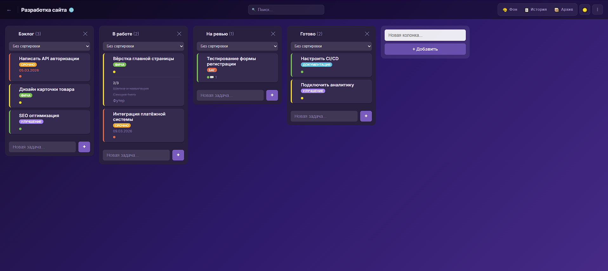
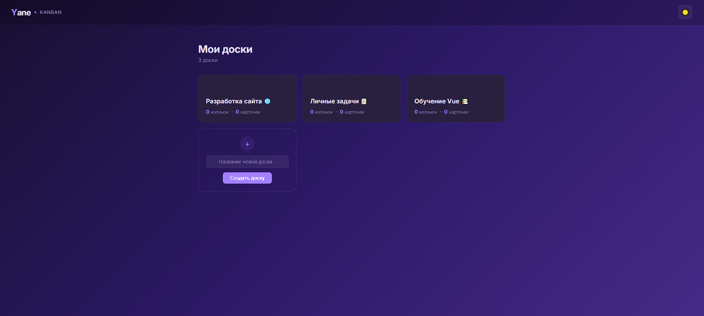
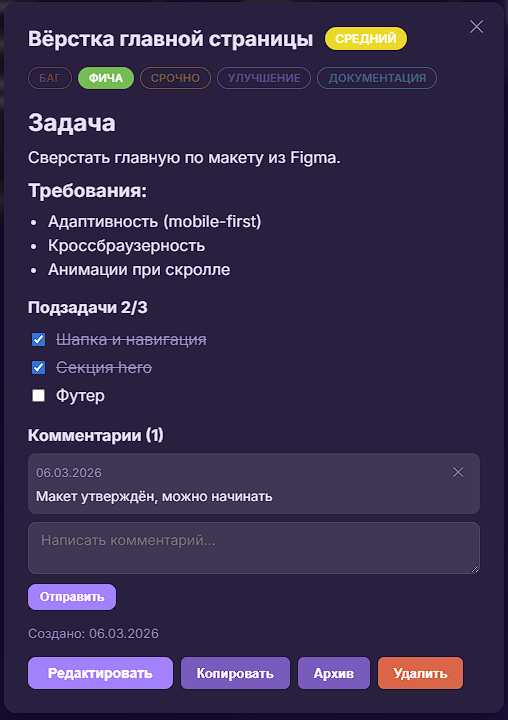
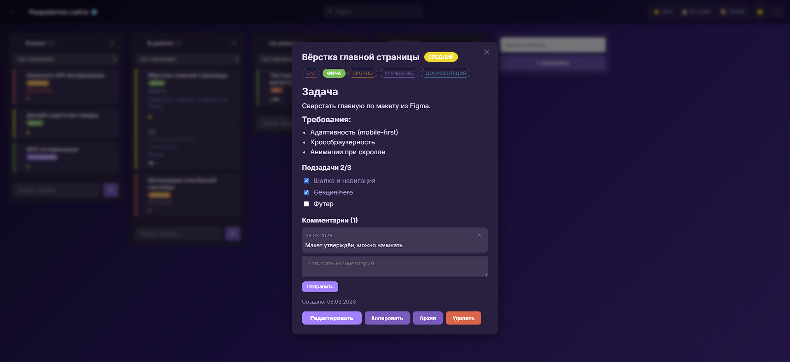
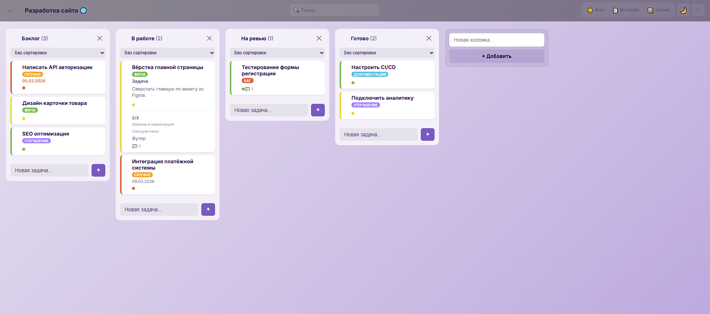
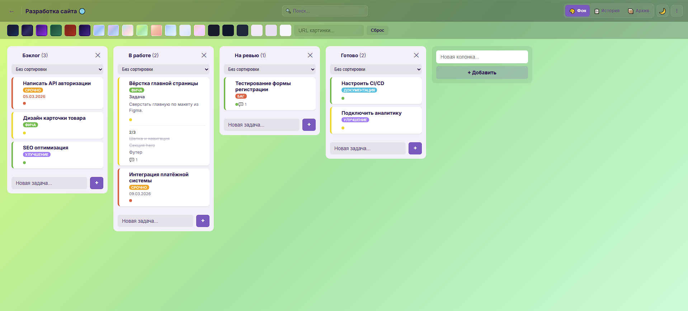
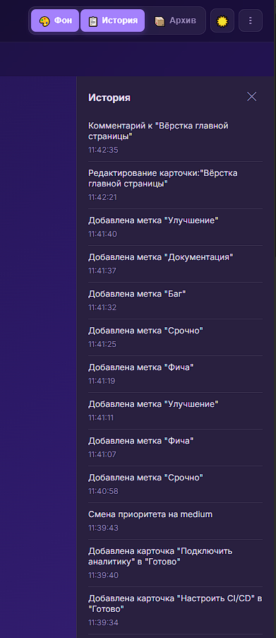

# Vue Kanban Board

Канбан-доска для управления задачами. Поддержка нескольких досок, drag & drop, приоритеты, теги, подзадачи, комментарии, Markdown-описания, темы оформления и многое другое. Все данные хранятся локально в браузере (localStorage).



## Возможности

- Несколько досок с отдельными маршрутами
- Drag & drop карточек и колонок
- Приоритеты (низкий / средний / высокий) с цветовыми метками
- Теги: Баг, Фича, Срочно, Улучшение, Документация
- Дедлайны с подсветкой просроченных
- Подзадачи (чеклист) с прогрессом выполнения
- Комментарии на карточках
- Markdown в описании карточки
- Копирование и архивация карточек
- WIP-лимиты с прогресс-баром на колонке
- Сортировка карточек (по приоритету, дате, имени)
- Поиск карточек
- Экспорт / импорт доски (JSON)
- Тёмная и светлая тема
- Кастомный фон доски (цвет или картинка)
- История действий
- Toast-уведомления

## Скриншоты

### Главная страница



### Доска с карточками (тёмная тема)


### Модальное окно карточки

<p align="center">
  
</p>



### Светлая тема



### Кастомный фон



### История действий

<p align="center">
  
</p>

## Стек технологий

| Технология | Назначение |
|------------|------------|
| Vue 3.5 | UI фреймворк (Composition API, `<script setup>`) |
| TypeScript | Типизация |
| Vue Router | Маршрутизация (несколько досок) |
| Pinia | Глобальный state management |
| vuedraggable | Drag & drop карточек и колонок |
| marked | Парсинг Markdown |
| Vite | Сборщик |

## Установка и запуск

```bash
npm install
npm run dev
```

Приложение будет доступно по адресу `http://localhost:5173`

### Сборка для продакшена

```bash
npm run build
```

## Структура проекта

```
src/
├── components/          # Компоненты
│   ├── KanbanBoard.vue  # Доска (колонки, фон, header)
│   ├── KanbanColumn.vue # Колонка (карточки, сортировка, WIP)
│   ├── KanbanCard.vue   # Карточка (приоритет, теги, дедлайн)
│   └── CardModal.vue    # Модалка карточки (описание, подзадачи, комментарии)
├── views/               # Страницы
│   ├── HomeView.vue     # Список досок
│   └── BoardView.vue    # Страница доски
├── stores/              # Pinia stores
│   ├── boards.ts        # CRUD досок
│   └── theme.ts         # Тема оформления
├── composables/         # Composables
│   ├── useLocalStorage.ts
│   ├── useHistory.ts
│   ├── useToast.ts
│   ├── useBackground.ts
│   └── useBoardActions.ts
├── types/index.ts       # TypeScript интерфейсы
├── data/tags.ts         # Предопределённые теги
├── styles/common.css    # Общие CSS-классы
└── router/index.ts      # Маршруты
```

## Лицензия

MIT
